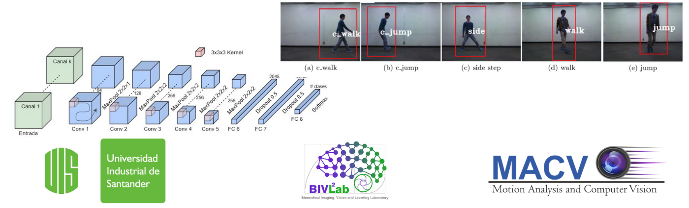

# Computer Vision UIS 2019-2 Final Project

# Reconocimiento de acciones en video usando Inteligencia artificial
### Edgar Yesid Rangel Pieschacon

*Universidad Industrial De Santander*  
*Ingenieria de sistemas* 
*2019* 

# Objetivo principal

- Proponer un modelo de aprendizaje profundo convolucional volumetrico que clasifique acciones.

# Objetivos

- Seleccionar un conjunto de datos académicos y públicos relacionados con el reconocimiento de acciones.
- Proponer un modelo de aprendizaje profundo sobre volúmenes de datos para codificar relaciones espacio-temporales.
- Clasificar las acciones dadas por los conjuntos de datos académicos seleccionados aplicando los métodos vistos en clase.

# Aplicaciones posibles

- Video vigilancia.

- Analisis deportivo.

- Traduccion de señas.

- Apoyo al diagnostico de enfermedades motoras como el parkinson.

# Presentacion y Video

Se encuentra en el github con el archivo <u>Proyecto_CV.pdf</u>
